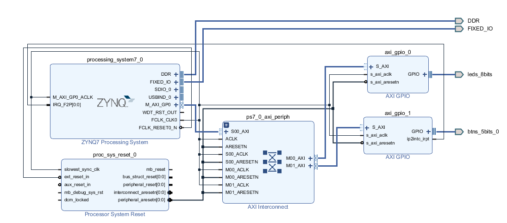

## BLOCK DESIGN




## 中斷註冊與啟用

```c
XScuGic_Connect(&INTCInst, INTC_GPIO_ID, (Xil_ExceptionHandler)Intr_Handler, &BTN);
XScuGic_Enable(&INTCInst, INTC_GPIO_ID);

XGpio_InterruptGlobalEnable(&BTN);
XGpio_InterruptEnable(&BTN, BTN_INT);
```

---

## 中斷Handler

```c
void Intr_Handler() {
    delay(10000);  // debounce

    XGpio_InterruptDisable(&BTN, BTN_INT);
    XGpio_InterruptClear(&BTN, BTN_INT);

    Intr_CTN++;
    printf("Interrupt: %d\n", Intr_CTN);

    // 每按一次按鈕就讓 LED 閃爍一次
    XGpio_DiscreteWrite(&LED, 1, 0xFF);
    delay(500);
    XGpio_DiscreteWrite(&LED, 1, 0x00);

    XGpio_InterruptEnable(&BTN, BTN_INT);
}
```

## DEMO
https://youtube.com/shorts/DPCkqy7YqvA